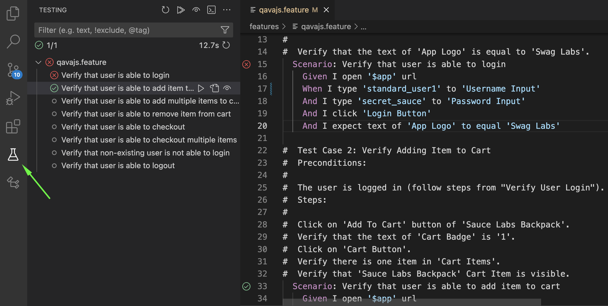

# Visual Studio Code

https://github.com/qavajs/vscode/releases

https://marketplace.visualstudio.com/items?itemName=qavajs.qavajs

## Features

- VSCode Test Explorer
- Steps autocomplete

## Extension Settings

This extension contributes the following settings:

* `cucumber.features`: gherkin files paths (array)
* `cucumber.glue`: step definition file paths (array)
* `qavajs.launchCommand`: qavajs launch command (default: `npx qavajs run`) (string)

```json
{  
    "files.associations": {
        "*.feature": "cucumber"
    },
    "cucumber.features": [
        "features/**/*.feature"
    ],
    "cucumber.glue": [
        "node_modules/@qavajs/**/src/*.ts",
        "step_definition/*.ts"
    ],
    "qavajs.templates": [
        "templates/*.feature"
    ],
    "qavajs.launchCommand": "npx qavajs run --config config.ts",
}
```

## How To Use

### Test Explorer


## Known Issues and Limitation