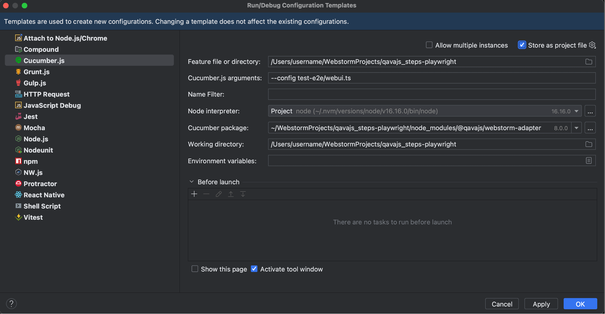

# Webstorm
qavajs can be integrated with Webstorm using built-in cucumberjs plugin.
First, install webstorm-adapter package

`npm install @qavajs/webstorm-adapter`

Then create new run configuration template and repoint cucumberjs package to @qavajs/webstorm-adapter.
Optionally, set additional qavajs arguments (like config, profile, etc)

In case you are using typescript to run, you need to change nodejs executable to ts-node installation
